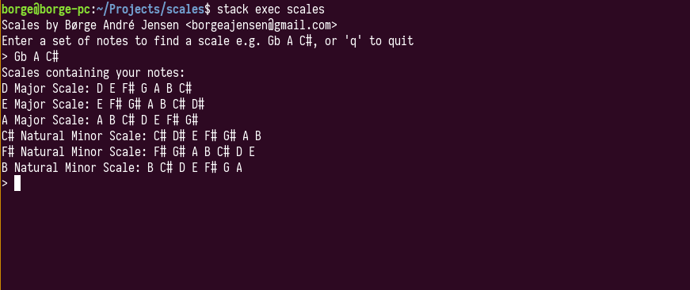

# scales

Scales is a small project I made to help me find (musical) scales given a set of notes, and
to practice Haskell.



## Requirements

- [Stack](https://docs.haskellstack.org/en/stable/README/)

## Running

1. Build:

```bash
$ stack build
```

2. Run:

```bash
$ stack exec scales
```

## Todo

* Add more scales
